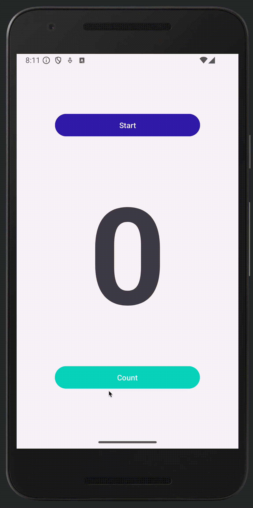

# Assignment 1: Mobile and Wearable Computing

Alessandro Gobbetti

---

## Introduction

This first assignment is to get familiar with the Android Studio IDE and Android development in general.

## Results

For more details, please refer to the [report](tex/MWC_Alessandro-Gobbetti_Assignment1.pdf).

